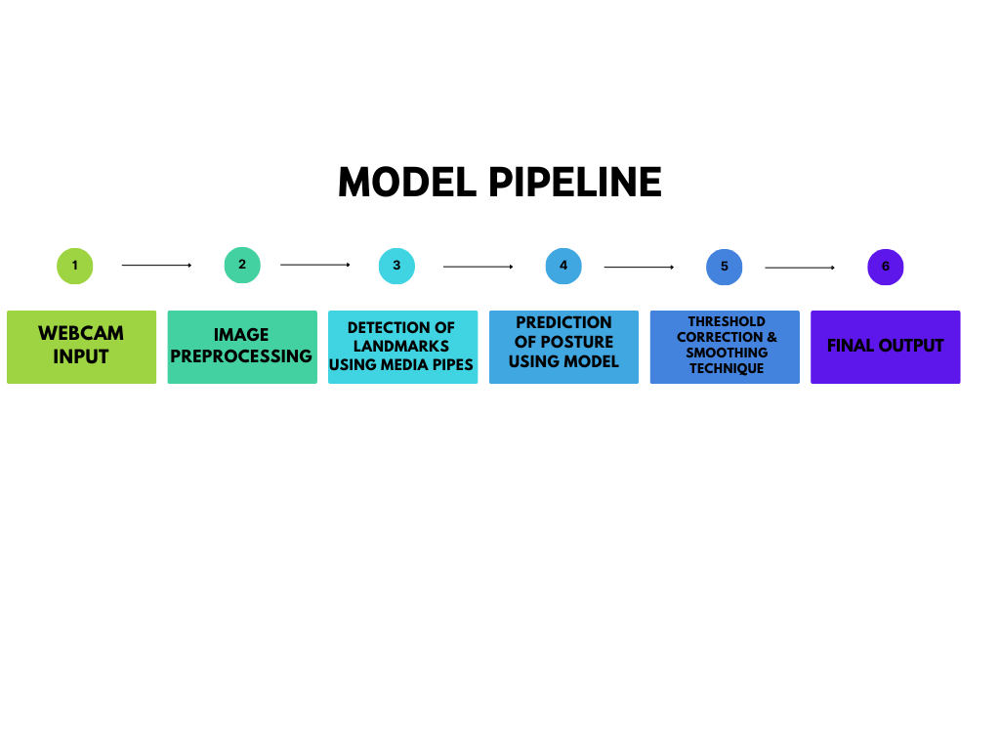

# dontslouch

## Overview

The **dontslouch** project utilizes computer vision techniques and deep learning models to analyze a person's posture in real-time using a webcam feed. By estimating key body landmarks and extracting relevant features, the system determines whether the individual is slouching or maintaining proper posture. It provides immediate feedback on-screen and through console output, enabling applications in ergonomics, healthcare, and wellness tracking.

In healthcare, the posture detection system plays a crucial role in preventing and managing musculoskeletal disorders, which are often caused by poor posture. It fosters workplace ergonomics and overall employee health and productivity. This approach offers a proactive solution to support long-term well-being.

## Features

- **Pose Estimation**: MediaPipe captures and analyzes video feed from a webcam, detecting and tracking the body’s key-points (e.g., shoulders, nose) in real-time.
  
- **Data Collection and Preprocessing**: Image data of both correct and slouching postures are collected and labeled to train the machine learning model. Key-points data are extracted and normalized.
  
- **Model Training**: PyTorch is used to distinguish between slouching and correct postures based on key-points data. Cross-validation ensures the model's generalizability.
  
- **Integration**: The trained model is integrated with the pose estimation pipeline, providing visual indicators or alerts to inform the user when slouching is detected.
  
- **Testing and Refinement**: The system is tested under various conditions with different users to validate and refine the model’s accuracy and responsiveness.
  
- **Deployment**: The system can be set up for easy use in everyday scenarios, such as at a workspace or during specific activities that require posture monitoring.

## Functionality

- **Real-Time Posture Monitoring**: Assesses the alignment of key points to determine if the user's posture is upright or slouched.
  
- **Visual Alerts**: Notifies users through on-screen prompts when poor posture is identified, helping to correct posture on-the-fly.
  
- **Historical Data Tracking**: Keeps a record of posture data over time, enabling users to track their progress and understand posture habits better.
  
- **Multi-Platform Compatibility**: Designed to work on various operating systems and devices, ensuring accessibility for a broad range of users.
  
- **Low Resource Utilization**: Optimized to run smoothly without consuming excessive computational resources, suitable for use on standard consumer hardware.
  
- **Scalable and Extendable**: Built with scalability in mind, allowing for further development and integration, such as adding support for multiple users or incorporating more advanced biomechanical analysis.

## Considerations

- **Dataset Diversity**: Obtaining a diverse and representative dataset for training posture detection models, capturing a wide range of slouching and non-slouching postures.
  
- **Pose Estimation Accuracy**: The accuracy of pose estimation algorithms like MediaPipe varies based on factors like lighting conditions, background clutter, and user clothing, potentially leading to inaccuracies in landmark detection.
  
- **Model Generalization**: The trained model should generalize well to new users and environments, beyond the data it was trained on, crucial for real-world deployment.
  
- **User Variability**: Users may have varying body shapes, sizes, and sitting habits, affecting the effectiveness of the detection algorithm.

## Future Enhancements

- **Multi-person Detection**: Extending the system to detect and analyze posture for multiple users simultaneously, such as in collaborative environments.
  
- **Dynamic Thresholds**: Implementing thresholds or adaptive algorithms that adjust detection criteria based on individual user characteristics, such as height or torso length.
  
- **Long-term Monitoring**: Providing posture monitoring, tracking trends over time, and offering insights or recommendations for posture improvement strategies.

## Usage

- Clone the repository.
- Install the necessary dependencies.
- Run the application with a webcam connected to your device.
- Follow the on-screen prompts for real-time posture feedback.

## Acknowledgments

- This project is made possible by the contributions of [contributors].
- Special thanks to [mentors or advisors] for their guidance and support.

## License

This project is licensed under the [GPL-V3] License - see the [LICENSE.md](LICENSE.md) file for details.
